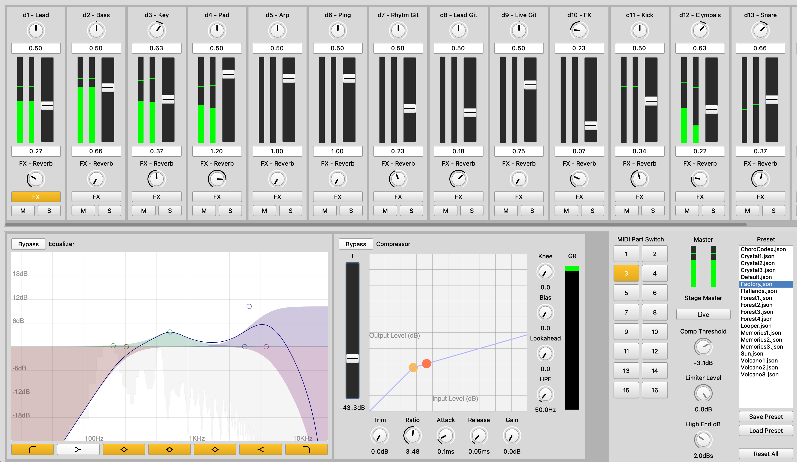

# SuperDirtMixer (MrReason setup version)

This is a mixer ui was created for the sound engine **SuperDirt** https://github.com/musikinformatik/SuperDirt for the **TidalCycles** http://tidalcycles.org/ programming language. The main motivation of this mixer was to get rid of using a DAW like Ableton in a live coding setup, because the author just used it for mixing a live setup. This mixer helps to realize tonal depth, clean frequency separation, signal compression and a stereo panorama and makes this easily accessible in SuperDirt. In general this mixer overwrites the default values of the orbits defaultParentEvents. This means i.e. that it allows to change the value for pan from 0.5 to a different value from 0 to 1. These defaultParentEvent values will be used until they get overwritten on the TidalCycles side.

For the EQ of an orbit, this plugin is using EQui (https://github.com/thgrund/EQui). For this it's needed to add some additional values to the defaultParentEvent to store and change the EQui parameters which will be done during the initialisation of this mixer. The eq functionality was added as a global effect to every orbit. This allows you to change the eq parameters for every orbit and still use all the other filter like hpf or lpf.



## Requirements

- [TidalCycles](https://github.com/tidalcycles/Tidal) v1.9.4+
- [SuperDirt Quark](https://github.com/musikinformatik/SuperDirt) v1.7.3+ (latest develop branch version)

## Features

### Mixer

- Level indicators for each SuperDirt orbit to monitor the loudness of each signal.
- Adjustable controls for panning, master gain, and reverb amount.
- Mute and solo options for individual orbits.

### Equalizer

- Five different filter types: high pass, low shelf, 3x peak, high shelf, and low pass filters.
- Graphical representation of the applied filters as frequency curves.
- Toggleable filter buttons to enable and disable all available filters.

### Dynamic Range Compressor

- A fully functional digital dynamic range compressor with standard parameters such as threshold, ratio, attack, release, and gain.
- Graphical representation of the amplitude values, threshold, and ratio of the compressor.
- Visual feedback for gain reduction.

### Stage Master

- User interface for a light mastering chain based on [StageMaster](https://github.com/calumgunn/StageMaster).
- Off by default but can be activated for live use.

### Preset Management

- Save and load presets.
- Files are stored in plain JSON format.
- Reset all parameters to their default values.

## How to install it

You can download the bundled zip from this GitHub repository, unpack it and install the Quark in SuperCollider. You can do this in SuperCollider via `Language -> Quarks -> Install a folder`.

## How to use it

Pass this in your startup file after you installed it:

```C
(
    s.waitForBoot {
        ~dirt = SuperDirt(2, s);
        ~dirt.start(57120, 0 ! 14);
        // More SuperDirt ...

        // Initialize the SuperDirtMixer
        ~mixer = SuperDirtMixer(~dirt, 6010);

        // You can adjust parameters before you use the ui
        ~mixer.orbitLabels = ["d1 - Lead", "d2 - Bass", "d3 - Key", "d4 - Pad"];
        ~mixer.enableMasterPeakRMS(0)
    }
)
```

And then you can render the gui with executing this in any SuperCollider file 
```c
~mixer.gui
```

For more in depth configuration options you can have a look into the helpfile. This is accessable in SuperCollider when your cursor is on `SuperDirtMixer` and you press i.e. `Command + D` on MacOS. 

## Shoutouts

- Wouter Snoei for the MasterEQ which influenced the EQui
- Scott Wilson for the EQui project that I extended for this project
- Alik Rustamoff for the Dynamic Range Compression tutorial

